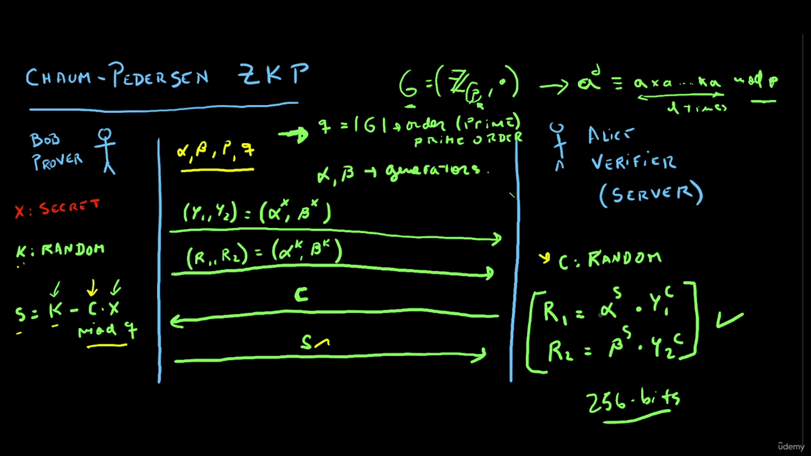

# zero-knowledge-proofs-in-rust

origin->github
// main -> basic branch 

# Zero-Knowledge Proofs 
1. Theoretical Background -> CHAUM-PEDERSEN-PROTOCOL 
2. Pratical Implemenation -> rust, big integers 
3. Develop a server/client -> gRPC sever 
4. Dockerization 

### MODULAR ARITHMETICS 

GROUPS -> Set + Operation
CLOSURE-> when combining two set element and we get other elements in the set 

ASSOCIATIVITY -> (a.b).c == a.(b.c) . is operation

IDENTITY -> when we condutuct any operation we get the same element

INVERSE -> a step back of prevouius give previous itlself

COMMUTATIVE -> chaging the order of element in operation -> Abelian group

### Generators
funtion to generate the random no 

## Discrete Logarithm Problem
https://www.youtube.com/watch?v=za9azzh4v9A

doing onething in one direction is easy but in reverse is hard like guessing game 
4 + 5 = 9 but we can't guess the reverse

**Primitive root** of the group is the element by which we can generate the whole group by the repeating the same operation again and again 

eg take 17 is prime no

5 is primitive root

5 mod 17 

5^2 mod 17

5^3 mod 17 

.......
5^16 mod 17 give unique result and form the group or generator

**Reversing it hard**  -> discrete logarithm problem   

# CHAUM-PEDERSEN ZKP protocol 
A cryptographic method that allows one party(the prover) to convince another party(the verifier)  that they know something without revealing that information itself

### 3 fundamentel properties 
1. **COMPLETENESS** -> If the statement is true, an honest prover must able to convince the verifier

2. **SOUNDNESS** -> If the statement is false, no dishonest prover can convince an honest verifier

3. **ZERO-KNOWLEDGE** -> The verifier must learn  nothing except that the prover's statement is true

### Interactive zk proofs **VS** Non-interactive zk proofs

**Trusted setup** : a trusted setup ceremony is a procedure that is done ones to generate some data  that must be used every time some cryptographic protocol is run.

## Working 
Bob/Provider&nbsp;&nbsp;&nbsp;&nbsp;&nbsp;&nbsp;&nbsp;&nbsp;&nbsp;&nbsp;&nbsp;&nbsp;&nbsp; Alice/Verifer/Server

1. Bob will send  (Y1, Y2) = (&alpha;x, &beta;x)
2. Again bob will send (R1, R2) = (&alpha;k, &beta;k)  where x is seceret and k is random no.
3. Then Alice(Server) will send C where C is random no
4. Then Bob will send S = K - C.x mod p 
5. The Alice will check if R1 = &alpha;S x Y1C and 2 = &beta;S x Y2C

then we can tell Bob have seceret no or not 

### Code Structure
For Y1 = &alpha;x mod p : Function **Exponentiante**

For S = K - C.X mod q : Function **Solve**

For Checking : Function **Verify**

For Random Number: Funtion **Random Generator**

Unit Test -> to verfiy the funtion work perfectly

## 1024 bit test very important for the test 

## Additional Diffie-Hellman Groups 
https://datatracker.ietf.org/doc/html/rfc5114

## gRPC server 
### google Remote Procedure Calls 
used in connection with server used in microservers